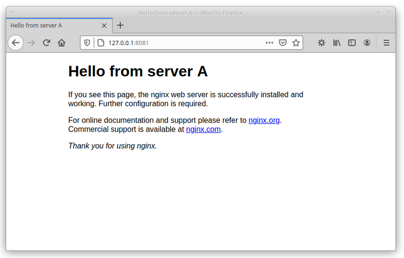
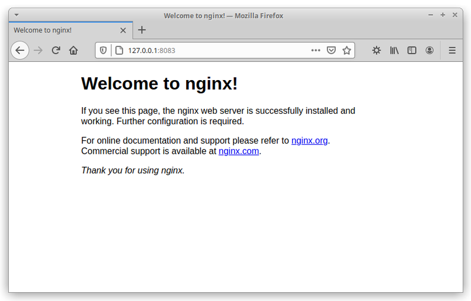

# Nginx containers with custom messages

Customize the default page greeting of the Nginx Docker image by adding a single parameter.


## Running the container

```bash
$ docker run -p 8081:80 -e MSG='Hello from Server A' --name serv_a herreriasjose/nginx
```
<p align="center">

</p>

```bash
$ docker run -p 8082:80 -e MSG='Hello from Server B' --name serv_b herreriasjose/nginx
```
<p align="center">

</p>

```bash
$ docker run -p 8083:80 --name serv_raw herreriasjose/nginx
```
<p align="center">

</p>

## What if you want to further change the default page of the Nginx image?

By default, Nginx looks in the /usr/share/nginx/html directory inside the container for the files to serve. If we modify those files we can change the default page displayed.

You can find more information here: https://www.docker.com/blog/how-to-use-the-official-nginx-docker-image/


## Author

* **Jose Herrerías**

## License

This project is licensed under the MIT License - see the [LICENSE.txt](LICENSE.txt) file for details

## Acknowledgments

*  https://github.com/Wouter-M/docker-hello-world

